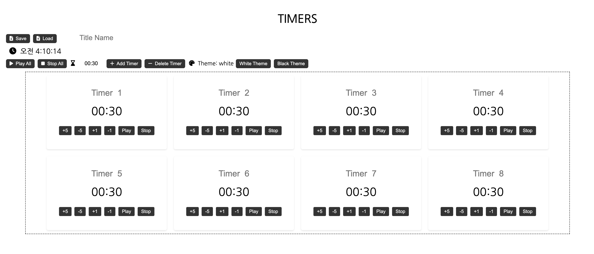
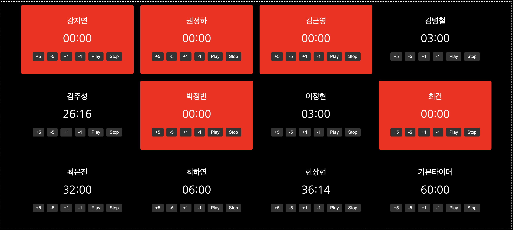

# Multiple Timer

You can use Multiple timers at once, in one screen.

After adding as many timers as you want, you can run timer individually or together.

## Feature

1. **Add Timer / Delete Timer**

   Add or delete timer as you want.

   You can edit initial time before adding timer, by edit time value(hourglass shape) on the left of the 'Add Timer' button.

3. **Increase Time / Decrease Time**

   Increase or decrease time in each.

4. **Play / Stop**

   Play or stop timer in each.

5. **Play All / Stop All**

   Play or stop All timer at once.

6. **Change Theme**

   Change theme color, white or black.

7. **Save / Load**

   Save the current state, Load the saved state.

   Can save only 1 data. If you save again, data will overwrite the previous one.

## How To Use

1. Download project

   git clone https://github.com/CreamMeatball/MultipleTimer.git

2. Install requirements

   Command "npm install"

3. Run server

   Command "nodemon app.js" in terminal.

4. Connect

   Connect web in "http://127.0.0.1:3000/"

